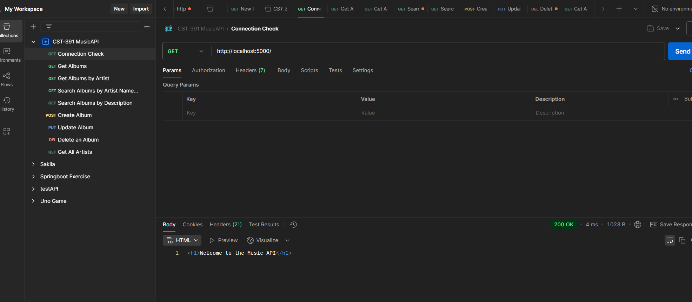
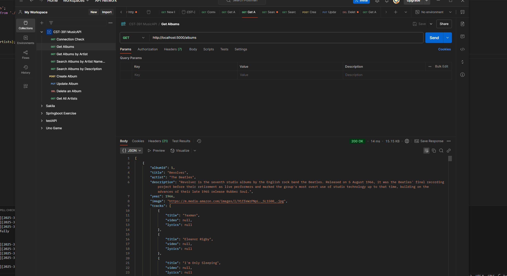
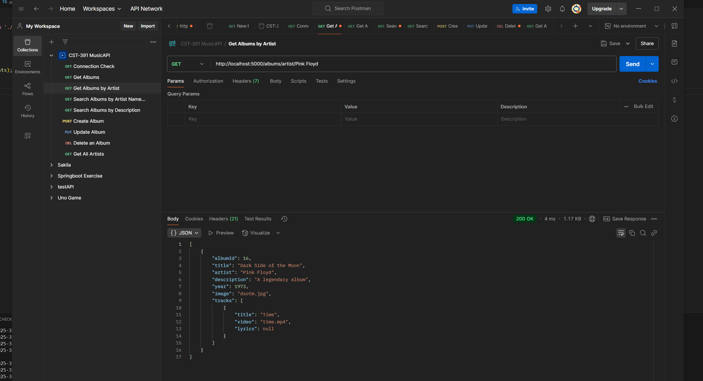
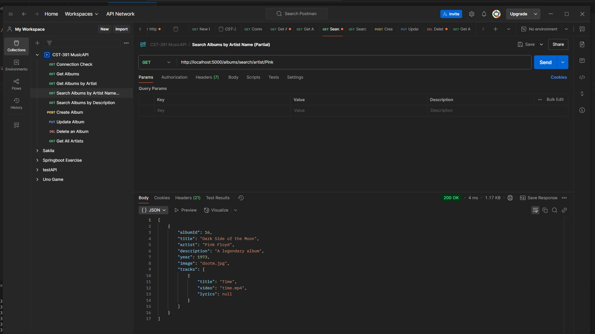
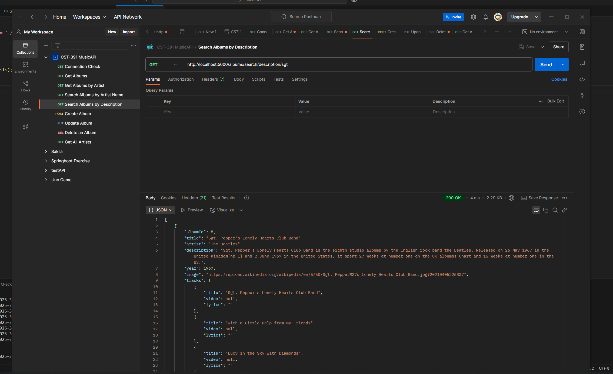
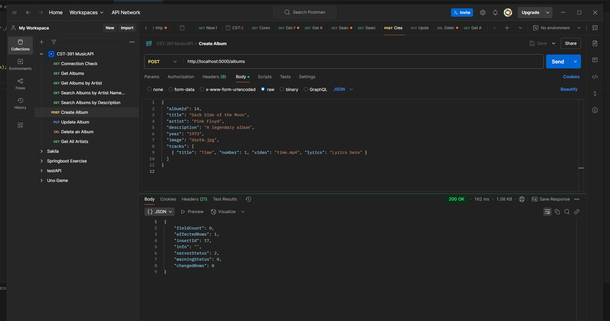
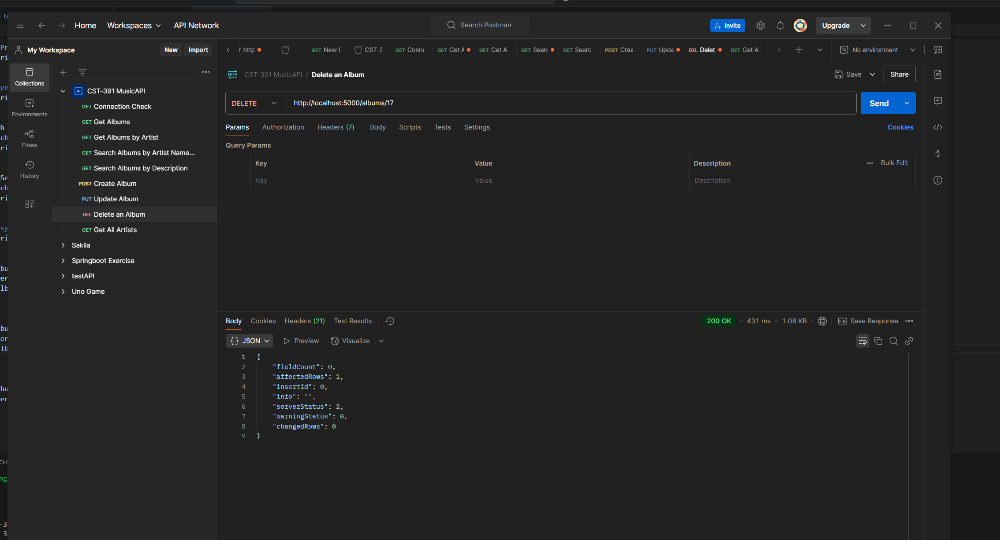
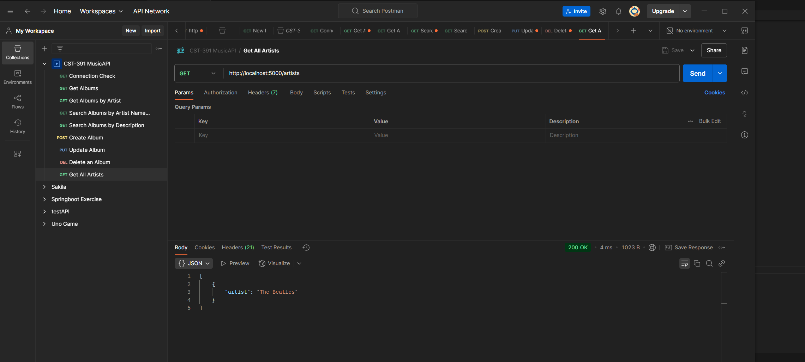

# Activity 1: Express API  
**CST-391 JavaScript Web Application Development**  
**Matt Kollar**

This document demonstrates the nine endpoints of the **MusicAPI** and includes a screencast recording link.

---

## Table of Contents
1. [Connection Check](#connection-check)
2. [Get All Albums](#get-all-albums)
3. [Get Albums by Artist](#get-albums-by-artist)
4. [Search Albums by Name](#search-albums-by-name)
5. [Search Albums by Description](#search-albums-by-description)
6. [Create Album](#create-album)
7. [Update Album](#update-album)
8. [Delete Album](#delete-album)
9. [Get All Artists](#get-all-artists)
10. [Screencast Recording](#screencast-recording)

---

## 1) Connection Check
**Endpoint:** `GET http://localhost:5000/`  
**Screenshot:**  


**Description:**  
This confirms the server is running by returning a simple `<h1>Welcome to the Music API</h1>` response.

---

## 2) Get All Albums
**Endpoint:** `GET http://localhost:5000/albums`  
**Screenshot:**  


**Description:**  
Returns a list of all albums in the database. The JSON response contains an array of album objects.

---

## 3) Get Albums by Artist
**Endpoint:** `GET http://localhost:5000/albums/artist/The Beatles`  
**Screenshot:**  


**Description:**  
Retrieves albums for a specific artist, in this case, **"The Beatles"**.

---

## 4) Search Albums by Name
**Endpoint:** `GET http://localhost:5000/albums/search/artist/Beat`  
**Screenshot:**  


**Description:**  
Returns albums where the artist name contains `"Beat"`.

---

## 5) Search Albums by Description
**Endpoint:** `GET http://localhost:5000/albums/search/description/sgt`  
**Screenshot:**  


**Description:**  
Returns albums whose description contains the substring `"sgt"`.

---

## 6) Create Album
**Endpoint:** `POST http://localhost:5000/albums`  
**Screenshot:**  


**Body (JSON Example):**
```json
{
  "title": "Dark Side of the Moon",
  "artist": "Pink Floyd",
  "description": "A legendary album",
  "year": "1973",
  "image": "dsotm.jpg",
  "tracks": [
    { "title": "Time", "number": 1, "video": "time.mp4", "lyrics": "Lyrics here" }
  ]
}
```

**Description:**  
Inserts a new album into the database. The response typically shows an `insertId` for the newly created record.

---

## 7) Update Album
**Endpoint:** `PUT http://localhost:5000/albums`  
**Screenshot:**  


**Body (JSON Example):**
```json
{
  "albumId": 1,
  "title": "Updated Album",
  "artist": "Updated Artist",
  "year": "2025",
  "image": "updated.jpg",
  "description": "Updated description",
  "tracks": []
}
```

**Description:**  
Updates an existing album’s information. The response confirms whether the update was successful.

---

## 8) Delete Album
**Endpoint:** `DELETE http://localhost:5000/albums/1`  
**Screenshot:**  


**Description:**  
Deletes an album by its ID. The response confirms the deletion.

---

## 9) Get All Artists
**Endpoint:** `GET http://localhost:5000/artists`  
**Screenshot:**  


**Description:**  
Returns a distinct list of artists from the database.

---

## 10) Screencast Recording
**Link:** [**(http://somup.com/cTeioy7tWi)**](#)

**Description:**  
A video demonstration of each endpoint in Postman, along with a detailed explanation of one API method (router → controller → DAO).

---

**End of Document**
